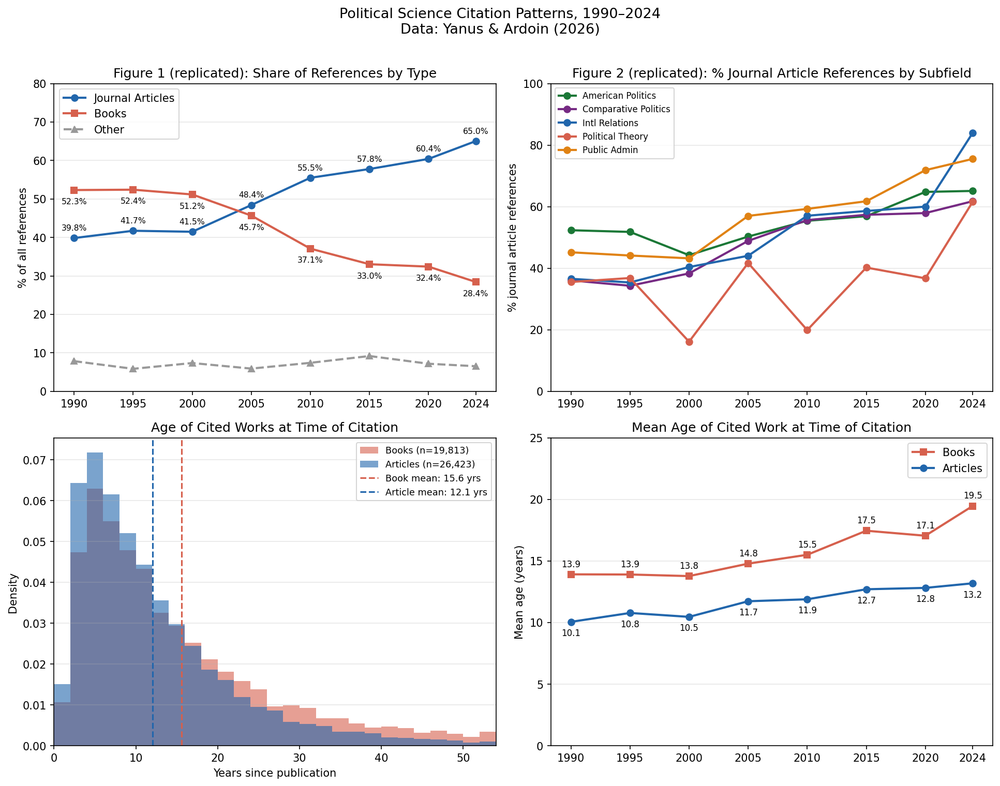

# Bookworm to Browser: Extension Analysis

> **This entire analysis — reading the paper, fetching the replication data, writing the code, running the analysis, and making the plots — was done by [Claude Code](https://claude.ai/code) (claude-sonnet-4-6) in a single conversation. See [TRANSCRIPT.md](TRANSCRIPT.md) for the full conversation.**

This repo replicates and extends the analysis from:

> Yanus, Alixandra B., and Phillip J. Ardoin. 2026. "From Bookworm to Browser: The Decline of Books in Political Science Scholarship." *PS: Political Science & Politics*. https://doi.org/10.1017/S1049096525101522

The paper documents a shift in political science citations from books (52% in 1990) to journal articles (65% in 2024), using 872 articles and 50,453 citations across 14 top journals from 1990–2024.

## What this repo adds

The paper's original analysis tracks *how many* citations go to books vs. articles over time, but doesn't ask how *old* the cited works are. This extension uses the `PublicationYear` field in the replication data to examine:

- **Are book citations skewing older than article citations?** Yes — cited books have a mean age of 15.6 years vs. 12.1 years for articles.
- **Is this gap growing over time?** Yes — the mean age of cited books has increased from ~14 years in 1990 to ~19.5 years in 2024, while article citation age is more stable (10 → 13 years). This suggests the books being cited today are increasingly "classic" titles rather than new releases.

## Files

- `reproduce_analysis.py` — Replicates Tables 1–2 and Figures 1–3 from the paper, then runs the age analysis
- `make_plots.py` — Generates `citation_analysis.png` with four plots
- `citation_analysis.png` — The plots (see below)
- `TRANSCRIPT.md` — Full transcript of the Claude Code conversation that produced this analysis
- `Aggregated_Data.tab`, `Aggregate_Data.xlsx`, `STATA_Commands.do` — Replication data from the authors' [Harvard Dataverse](https://doi.org/10.7910/DVN/KFZ3NZ)

The large file `Journal_Data_Final.xlsx` (~4.5MB, reference-level data) is downloaded from Dataverse but not committed; run `make_plots.py` or `reproduce_analysis.py` to fetch it automatically via the Dataverse API.

## Plots



**Top left:** Replication of Figure 1 — share of references by type, 1990–2024.  
**Top right:** Replication of Figure 2 — % journal article references by subfield (Political Theory is a notable outlier).  
**Bottom left:** Age distribution of cited books vs. articles at time of citation. Books have a much fatter right tail.  
**Bottom right:** Mean age of cited work over time. The gap between books and articles is widening.

## Requirements

```
pip install openpyxl matplotlib
```

Data is downloaded automatically from [Harvard Dataverse](https://doi.org/10.7910/DVN/KFZ3NZ).
